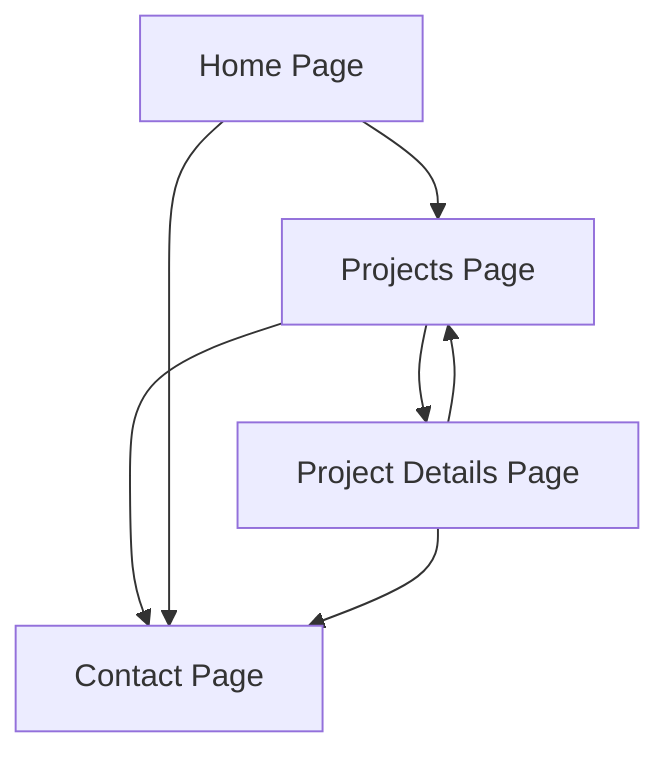

## 1. Product Overview
A modern portfolio website to showcase projects with images and descriptions, featuring an easy-to-find contact section. This website will help you present your work professionally and make it simple for potential clients or employers to reach out to you.

The portfolio solves the problem of creating a professional online presence, allowing users to display their projects visually with detailed descriptions and provide multiple contact methods for business opportunities.

## 2. Core Features

### 2.1 User Roles
This is a single-user portfolio website with no authentication required. All visitors can view projects and contact information.

### 2.2 Feature Module
Our portfolio website consists of the following main pages:
1. **Home page**: hero section with introduction, navigation menu, and call-to-action.
2. **Projects page**: grid layout showcasing all projects with thumbnail images and brief descriptions.
3. **Project details page**: detailed view of individual projects with multiple images, full description, and technologies used.
4. **Contact page**: contact form, social media links, and direct contact information.

### 2.3 Page Details
| Page Name | Module Name | Feature description |
|-----------|-------------|---------------------|
| Home page | Hero section | Display professional introduction with animated text and call-to-action button. |
| Home page | Navigation | Sticky navigation bar with smooth scrolling to sections and mobile-responsive hamburger menu. |
| Home page | About section | Brief professional summary with skills showcase and downloadable resume. |
| Projects page | Project grid | Responsive grid layout showing project cards with thumbnail images, titles, and brief descriptions. |
| Projects page | Filter system | Category-based filtering to sort projects by technology or type. |
| Projects page | Search functionality | Real-time search to find projects by name or technology. |
| Project details page | Image gallery | Multiple project screenshots with lightbox functionality for full-size viewing. |
| Project details page | Project information | Detailed description, technologies used, project duration, and key features. |
| Project details page | Navigation | Previous/next project navigation and return to projects list. |
| Contact page | Contact form | Form with name, email, subject, and message fields with validation. |
| Contact page | Contact information | Display email, phone number, and location with copy-to-clipboard functionality. |
| Contact page | Social links | Icons linking to GitHub, LinkedIn, Twitter, and other professional profiles. |
| Contact page | Map integration | Embedded map showing location with professional office address. |

## 3. Core Process
Users can navigate through the portfolio website to view projects and contact the portfolio owner. The main flow includes browsing the homepage, exploring projects, viewing detailed project information, and reaching out through the contact page.

## 4. User Interface Design

### 4.1 Design Style
- **Primary colors**: Deep blue (#1a365d) and white (#ffffff)
- **Secondary colors**: Light gray (#f7fafc) and accent orange (#ed8936)
- **Button style**: Modern rounded buttons with hover effects and smooth transitions
- **Font**: Inter font family with sizes 16px for body text, 32px for headings
- **Layout style**: Card-based design with clean spacing and modern grid layouts
- **Icons**: Professional line icons with consistent stroke width and modern styling

### 4.2 Page Design Overview
| Page Name | Module Name | UI Elements |
|-----------|-------------|-------------|
| Home page | Hero section | Full-width background with gradient overlay, animated text typing effect, prominent CTA button with hover animation. |
| Home page | Navigation | Transparent background that becomes solid on scroll, centered logo, right-aligned menu items with smooth hover underline effect. |
| Projects page | Project grid | 3-column responsive grid on desktop, 2-column on tablet, 1-column on mobile, card hover effects with image zoom and shadow elevation. |
| Project details page | Image gallery | Full-width hero image with thumbnail gallery below, lightbox modal with navigation arrows and close button. |
| Contact page | Contact form | Clean white background with subtle shadow, labeled input fields with focus states, large textarea for message, submit button with loading state. |

### 4.3 Responsiveness
The website is designed desktop-first with full mobile adaptation. All components are touch-optimized with appropriate tap targets, swipe gestures for image galleries, and mobile-specific navigation patterns. The layout gracefully adapts from desktop (1200px+) to tablet (768px-1199px) to mobile (below 768px) with appropriate font size scaling and spacing adjustments.