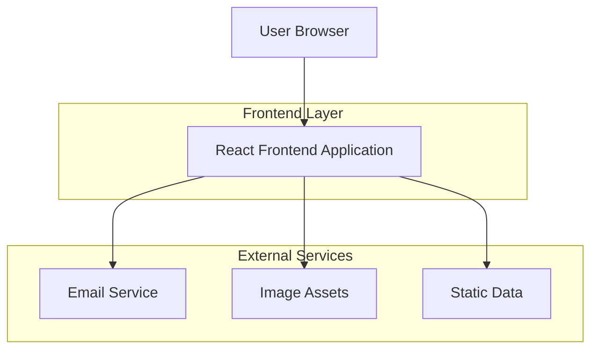
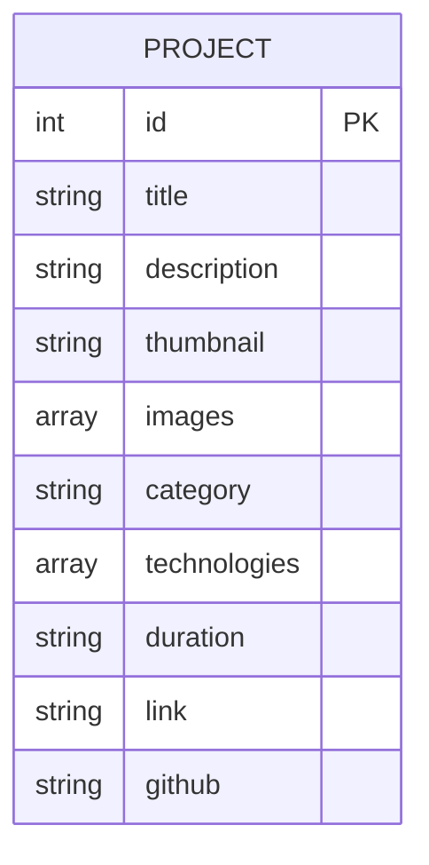

## 1. Architecture design



## 2. Technology Description
- Frontend: React@18 + tailwindcss@3 + vite
- Initialization Tool: vite-init
- Backend: None (Static site with email service integration)
- Email Service: EmailJS or Formspree for contact form functionality

## 3. Route definitions
| Route | Purpose |
|-------|---------|
| / | Home page with hero section and navigation |
| /projects | Projects showcase page with grid layout |
| /projects/:id | Individual project details page |
| /contact | Contact page with form and information |

## 4. API definitions
No backend API required. Contact form will use third-party email service integration.

### 4.1 Email Service Integration
```javascript
// Using EmailJS integration
emailjs.send('service_id', 'template_id', {
  from_name: formData.name,
  from_email: formData.email,
  subject: formData.subject,
  message: formData.message
});
```

## 5. Server architecture diagram
Not applicable - this is a static frontend application with external service integration.

## 6. Data model

### 6.1 Data model definition


### 6.2 Data Definition Language
Project data will be stored in a JSON file for easy maintenance:

```json
[
  {
    "id": 1,
    "title": "E-commerce Platform",
    "description": "Full-stack e-commerce solution with payment integration",
    "thumbnail": "/images/project1-thumb.jpg",
    "images": ["/images/project1-1.jpg", "/images/project1-2.jpg"],
    "category": "Web Development",
    "technologies": ["React", "Node.js", "MongoDB", "Stripe"],
    "duration": "3 months",
    "link": "https://example.com",
    "github": "https://github.com/username/project"
  }
]
```

Static configuration file for contact information:
```json
{
  "email": "your.email@example.com",
  "phone": "+1 (555) 123-4567",
  "location": "Your City, Country",
  "social": {
    "github": "https://github.com/username",
    "linkedin": "https://linkedin.com/in/username",
    "twitter": "https://twitter.com/username"
  }
}
```